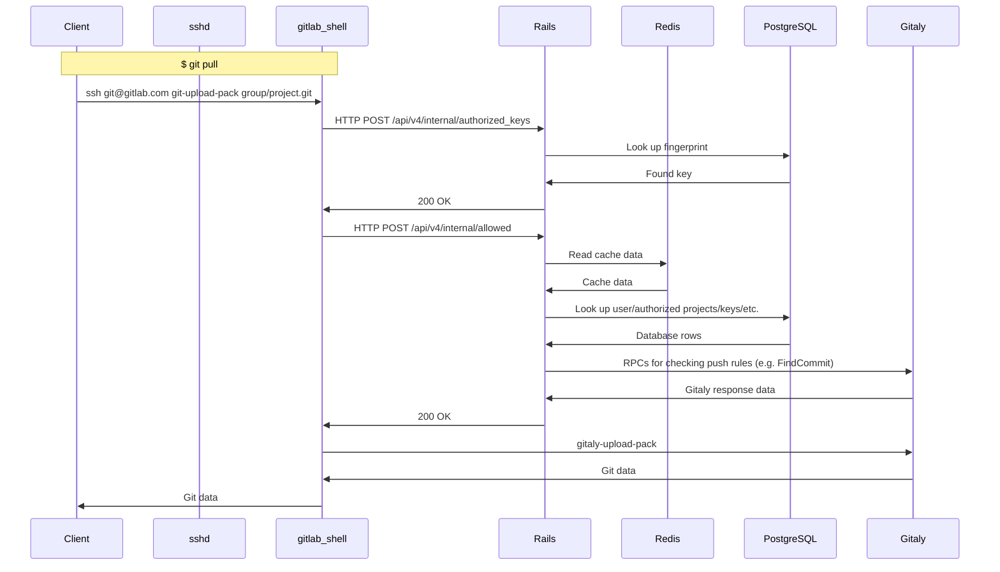

# GitLab Scalability

This document assumes working acknowledge of the [GitLab
architecture](architecture.md). Before we discuss the current limits of
GitLab scalability and discuss future direction, let's begin with a few
sample flows for some of the most frequent activities that occur today:

## Example 1: Git fetch over SSH

TODO:

## Git fetch over HTTPS
## Git push over SSH
## Loading merge requests (/project/merge_requests/:iid)
## Runner CI jobs
## API: /api/v4/projects

### Microservice Review

Over the past year, we've seen a number of incidents arising from
degradation of one or more services:

#### sshd

sshd (under Ubuntu 16.04, not Ubuntu 14.04) has generally been rock
solid. However, it requires careful tuning to make it work reliably at
scale. For example, as discussed in
https://gitlab.com/gitlab-com/gl-infra/infrastructure/issues/7168:

1. HAproxy should be configured with `leastconn`
1. sshd `MaxStartups` needs to be tuned

#### Observability

sshd does not provide any way to monitor directly via Prometheus
metrics. There are verbosity levels that be turned up, but they are not
on by default. We may want to consider contributing better logging
and/or direct instrumentation.

#### gitlab-shell

[gitlab-shell](https://gitlab.com/gitlab-org/gitlab-shell) started out
as a pure Ruby project but has almost nearly been rewritten in Go for
performance. It used to handle both incoming Git SSH traffic and also
Git hooks (e.g. pre-receive, post-receive, etc.), but now all Git hooks
have been moved into Gitaly where they belong, alongside the Git
repositories.

Rewriting in Go is essential for scalability because each time
gitlab-shell runs, it needs to load its Ruby dependencies, parse its
YAML config file, and then do its work. This can take on the order of
200-300 milliseconds to complete, adding unnecessary latency.

#### Observability

gitlab-shell currently runs short-lived processes that can not be
monitored with Prometheus easily. gitlab-shell could benefit from
pushing metrics to some Prometheus endpoint.

#### Rails

As seen in the diagrams above, Rails handles internal API checks from
gitlab-shell and Workhorse. These requests are among the most
frequently-used API requests, so it is imperative that they be extremely
fast and reliable.

##### /api/v4/internal/authorized_keys

This endpoint has a simple job: validate that the SSH key presented by
the user exists in the database. As we have seen in
https://gitlab.com/gitlab-com/gl-infra/infrastructure/issues/7168, the
P99 duration of this endpoint is fast enough but there is significant
queueing delay that is concerning.

Given its simplicity and performance implications, we may want to
consider moving this check outside of Rails and inside a dedicated
service.

###### Observability

For all internal API routes, we currently have no idea how much time is
spent due to queuing here. We have an open issue to route this through
Workhorse: https://gitlab.com/gitlab-org/omnibus-gitlab/issues/4583.

##### /api/v4/internal/allowed

The `/internal/allowed` endpoint is used to check whether a certain user
or SSH key has access to upload or download repository data.

This endpoint has been a constant source of problems over the years, both
from a reliability and a performance standpoint. For example:

1. Deploy tokens not working
1. Push rules timing out
    1. Path locks: https://gitlab.com/gitlab-org/gitlab-ce/issues/55137
    1. LFS pointer checks fail: https://gitlab.com/gitlab-org/gitlab-ee/issues/10799
    1. Repository size limits: https://gitlab.com/gitlab-org/gitlab-ee/issues/11126

Because of push rules, this endpoint often needs to communicate with
Gitaly to scan commits on disk.

#### Redis
#### PgBouncer
#### PostgreSQL
#### Gitaly

