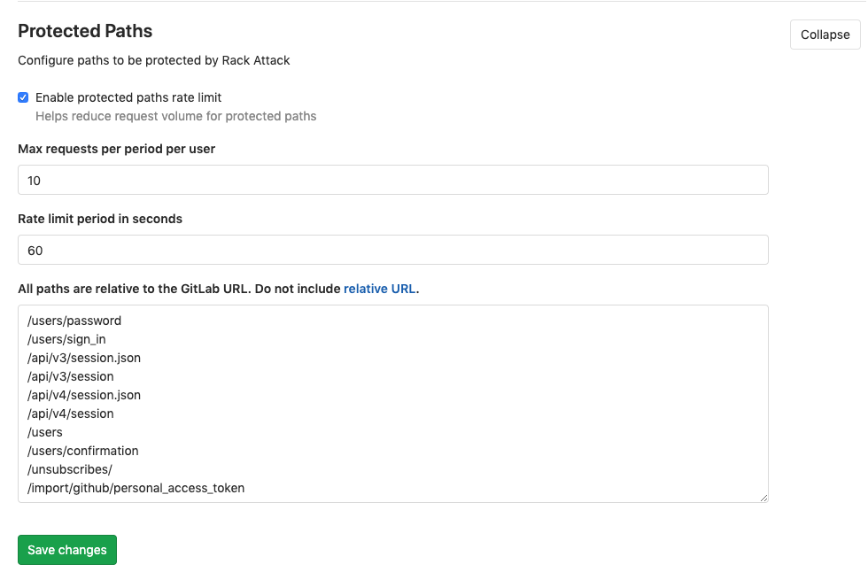

# Protected paths **(CORE ONLY)**

Note: **Note** Available from [GitLab 12.3](https://gitlab.com/gitlab-org/gitlab-ce/merge_requests/31246).

GitLab protects by default the following paths with Rack Attack:

```
'/users/password',
'/users/sign_in',
'/api/#{API::API.version}/session.json',
'/api/#{API::API.version}/session',
'/users',
'/users/confirmation',
'/unsubscribes/',
'/import/github/personal_access_token'
```

GitLab responds with HTTP status code `429` to POST requests at protected paths
that exceed 10 requests per minute per IP address.

This header is included in responses to blocked requests:

```
Retry-After: 60
```

For example, the following are limited to a maximum 10 requests per minute:

- User sign-in
- User sign-up (if enabled)
- User password reset

After 10 requests, the client must wait a minute before it can
try again.

Throttling of protected paths is enabled by default and can be disabled on
**Admin > Network > Protected Paths** along with:

- Highes number of requests per period per user.
- Rate limit period in seconds.
- Paths to be protected.



Requests over the rate limit are logged into `auth.log`.
